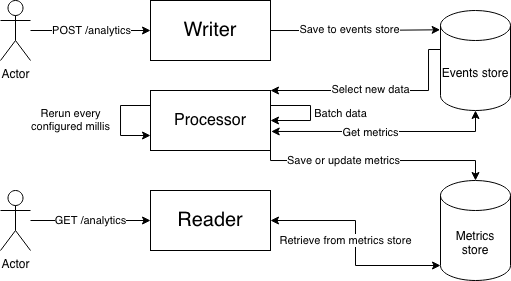

## Narrative challenge

### Solution architecture

The main goal of the solution was to provide as fast as possible writes. To achieve it, writing and reading parts are  
separated. During writing, no other operations, except saving to the database, are being done. On the other hand, during reading  
part only read from the database is being performed. To connect those two pieces, the so-called processor has been introduced.  
The processor is a projection, which reads analytics data (events) from the store and once in a while performs data analysis.  
To get the high-level overview of the solution, please check the diagram.




The solution suffers from eventual consistency where read after write might result with an incorrect result, but after  
while everything should be correct. Thanks to that it is much more scalable.

### Databases choice
Postgres database has been chosen as a main database for the challenge to not overcomplicate the solution.  
For that particular usecase it is not ideal. In the realworld scenario, one of the timeseries databases would be better.  
The main issue with postgres is poor performance during `distinct` queries, because of lack of the `loose indexscan` feature.

### Running challenge
To run the challenge, make sure that no other postgres instance is running in docker.

1. Start postgres with docker  
```docker-compose up```
2. Run sbt  
```sbt run```

Default postgres connection url is `localhost:5432/narrative` while http server starts on `localhost:8080`. If the server  
is not able to connect to postgres, the initial postgres db script might not have been executed. Stop previous postgres  
instance with `docker stop {id_of_postgres_docker_container}`